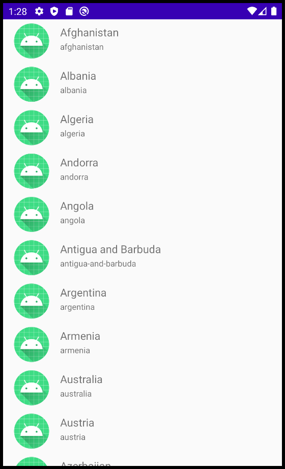
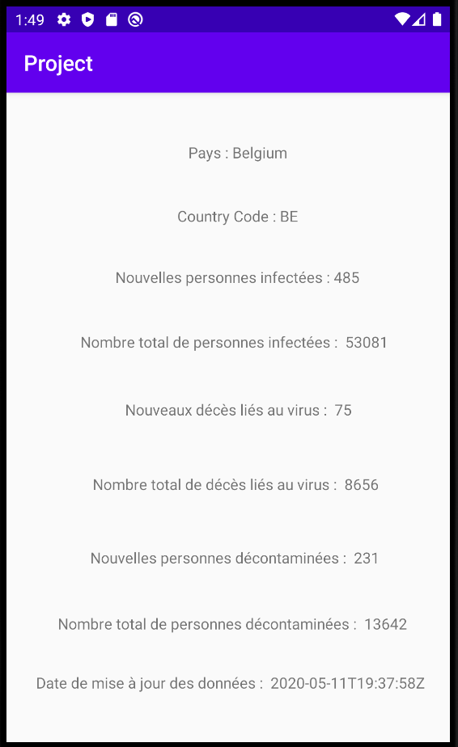

# Projet

Application présentant l'impact lié au covid-19 sur différents pays, réalisée par Clément Sorel (classe 33)

## Présentation

Cette application a été codé en java. Elle affiche un premier écran avec la liste d'un ensemble de pays. L'utilisateur a 
ensuite le choix de cliquer sur l'un des pays. Après cette action, une redirection se fait sur un deuxième écran affichant 
plusieurs informations : 

- Le pays sélectionné
- Le nombre de personnes infectées 
- Les nouveaux décès liés au virus
- Le nombre total de décès
- Le nombre de nouvelles personnes qui ne sont plus porteuses du virus
- Le nombre total de personnes désinfectées
- La date indiquant la mise à jour des données

## Prérequis

- Installation d'Android Studio
- Réalisation des TDs

## Consignes respectées

- Ecran avec une liste d'éléments
- Ecran avec le détail d'un élément
- Appel WebService à une API Rest
- Stockage de données en Cache
- Architecture : Design Patterns et Singleton

## Fonctionnalités

### Premier écran affichant une liste d'un ensemble de pays

### Deuxième écran qui affiche le détail d'un pays concernant le Covid-19

